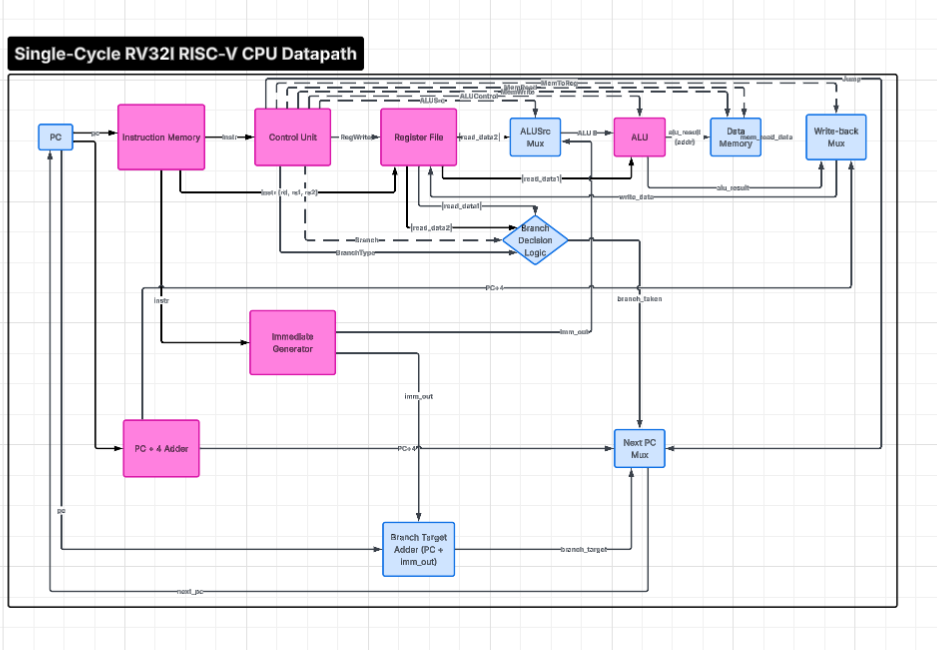
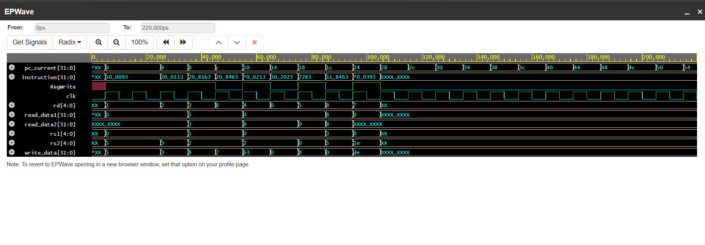

# riscv-single-cycle-cpu
Single-cycle RV32I RISC-V CPU implemented in Verilog
# Single-Cycle RV32I RISC-V CPU

A single-cycle RISC-V processor implementing a subset of the RV32I base 
integer instruction set, designed and verified from scratch in Verilog. 
Built as a learning project to understand datapath design, control unit 
logic, and instruction set architecture at the hardware level.

Every instruction completes in exactly one clock cycle — there is no 
pipelining, hazard detection, or forwarding logic, by design (see 
Known Limitations).

## Architecture



The datapath consists of 8 modules:

| Module | Purpose |
|---|---|
| `PC.v` | Program counter register, updates on every clock edge |
| `InstructionMemory.v` | Stores the program, loaded via `$readmemh` from `program.mem` |
| `RegisterFile.v` | 32 general-purpose registers (x0–x31), x0 hardwired to 0 |
| `ImmediateGenerator.v` | Extracts and sign-extends immediates for I/S/B/U/J instruction formats |
| `ControlUnit.v` | Decodes opcode/funct3/funct7 into datapath control signals |
| `ALU.v` | Performs arithmetic and logic operations |
| `DataMemory.v` | Memory for load/store instructions |
| `Datapath.v` | Top-level module wiring all of the above together |

## Supported Instructions

**R-type:** ADD, SUB, AND, OR, XOR, SLL, SRL, SRA, SLT  
**I-type:** ADDI, ANDI, ORI (arithmetic), LW (load)  
**S-type:** SW (store)  
**B-type:** BEQ, BNE  
**J-type:** JAL (partial support)

Branch support is intentionally scoped to BEQ/BNE. BLT/BGE/BLTU/BGEU 
are not implemented — see Known Limitations.

## Project Structure

```
riscv-single-cycle-cpu/
├── README.md
├── src/
│   ├── ALU.v
│   ├── RegisterFile.v
│   ├── InstructionMemory.v
│   ├── ImmediateGenerator.v
│   ├── ControlUnit.v
│   ├── DataMemory.v
│   ├── PC.v
│   └── Datapath.v
├── tb/
│   └── tb_Datapath.v
├── program.mem
└── docs/
    ├── BlockDiagram.png
    └── waveform.png
```
## How to Simulate

This project was developed and verified using [EDA Playground](https://www.edaplayground.com/) 
with the Icarus Verilog simulator.

1. Paste all files from `src/` and `tb/tb_Datapath.v` into the Testbench + Design panels
2. Add `program.mem` as an auxiliary file
3. Select **Icarus Verilog** as the simulator
4. Enable "Open EPWave after run"
5. Click Run

Alternatively, simulate locally with Icarus Verilog:
iverilog -o sim src/*.v tb/tb_Datapath.v
vvp sim
## Verification

The CPU was verified using a 10-instruction test program (`program.mem`) 
covering arithmetic, memory access, and both branch outcomes:

| Instruction | Purpose |
|---|---|
| `addi x1, x0, 5` | Arithmetic immediate |
| `addi x2, x0, 3` | Arithmetic immediate |
| `add x3, x1, x2` | Register-register arithmetic |
| `beq x1, x2, 8` | Branch not taken (5 ≠ 3) |
| `addi x4, x0, 99` | Confirms fall-through after not-taken branch |
| `sw x3, 0(x0)` | Store to data memory |
| `lw x5, 0(x0)` | Load from data memory |
| `beq x3, x5, 8` | Branch taken (8 == 8) |
| `addi x6, x0, 111` | Confirms this is correctly SKIPPED |
| `addi x7, x0, 222` | Confirms execution resumes after the jump |

### Results

Final register state: `x1=5, x2=3, x3=8, x4=99, x5=8, x6=0 (skipped), x7=222`

**Full execution trace — showing arithmetic, memory operations (SW/LW), 
branch not-taken (PC 0x0C), and branch taken (PC 0x1C → 0x24, skipping x6):**



## Known Limitations

This is a single-cycle design, so several things are intentionally out of scope:

- **No pipelining** — each instruction completes fully before the next begins, 
  so there are no data/control hazards to handle, no forwarding, no stalling.
- **Branch support limited to BEQ/BNE** — BLT, BGE, BLTU, BGEU are not implemented.
- **JAL is partially supported** — JALR and full jump-and-link semantics are not complete.
- **No exception/interrupt handling.**
- **256-word memory limit** — both instruction and data memory are sized for 
  small test programs, not full applications.
